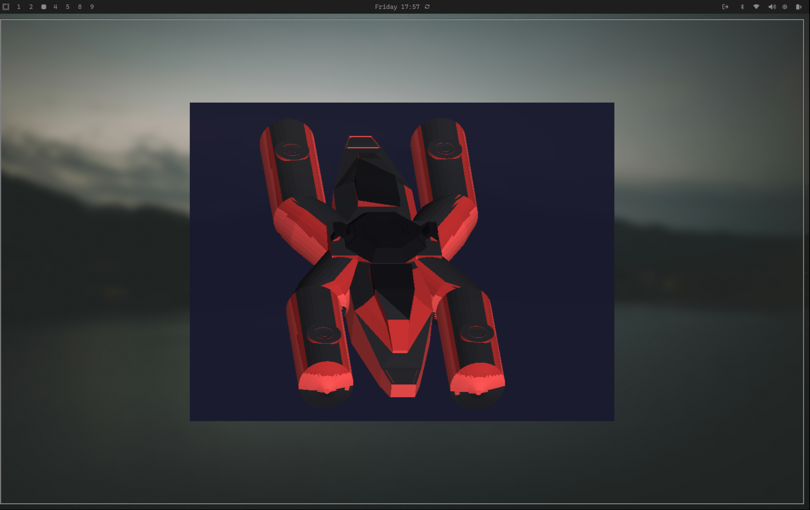

# Lab 4 - OBJ Model Viewer

Renderizador 3D de software en Rust que carga y visualiza modelos OBJ.

## Vista previa



La imagen anterior es una captura directa del rasterizador en ejecución.

## Características Implementadas

✅ **Pipeline Gráfico Completo:**
1. **Vertex Shader** - Transforma vértices con matrices de modelo
2. **Primitive Assembly** - Agrupa vértices en triángulos
3. **Rasterization** - Convierte triángulos en fragmentos usando coordenadas baricéntricas
4. **Fragment Processing** - Aplica iluminación y escribe al framebuffer con Z-buffer

✅ **Características del Renderizador:**
- Carga de archivos OBJ con `tobj`
- Rasterización de triángulos con coordenadas baricéntricas
- Z-buffer para manejo correcto de profundidad
- Flat shading con iluminación direccional
- Iluminación ambiente (60%) + difusa (40%)
- Transformaciones 3D completas (traslación, rotación, escala)

✅ **Modelo:**
- Nave espacial: **12,692 triángulos**, **38,076 vértices**
- Materiales y colores tomados de `lab3-nave.mtl`
- Fondo oscuro para resaltar el modelo

## Ejecutar

```bash
cargo run
```

## Controles

| Tecla | Acción |
|-------|--------|
| **↑↓←→** | Mover modelo |
| **A/S** | Reducir/Aumentar escala |
| **Q/W** | Rotar en eje X |
| **E/R** | Rotar en eje Y |
| **T/Y** | Rotar en eje Z |
| **ESC** | Salir |

## Configuración Inicial

- **Posición:** Centro de pantalla (400, 300)
- **Escala:** 200x
- **Rotación inicial:** 30° en X, 45° en Y para mejor vista
- **Iluminación:** Ambiente 60% + difusa 40%; colores desde el MTL

## Estructura del Código

```
src/
├── main.rs         - Loop principal y transformaciones
├── color.rs        - Utilidades de color RGB
├── framebuffer.rs  - Framebuffer de color y Z-buffer
├── vertex.rs       - Estructura de vértices
├── fragment.rs     - Fragmentos posteriores a rasterización
├── triangle.rs     - Rasterización baricéntrica + flat shading
├── line.rs         - Dibujo de líneas (debug/utilidades)
├── obj.rs          - Cargador de archivos OBJ/MTL
└── shaders.rs      - Vertex shader y transformaciones
bin/
└── test_triangle.rs - Programa de prueba (triángulo)
```

## Debug Info

Al ejecutar, verás:
```
Model loaded successfully!
Number of vertices: 38076
Number of triangles: 12692

First vertex:
  Position: (-0.339, -0.193, -1.660)
  Normal: (-0.000, -1.000, -0.000)

First transformed vertex:
  X: 135.0, Y: 432.6, Z: 331.0
First triangle generated 2628 fragments
Total fragments: 494245
Fragments written to framebuffer: 494245
```

Esto confirma que el modelo se está renderizando correctamente.

## Requisitos Cumplidos

✅ Cargar modelo OBJ del último lab
✅ Pintar en pantalla usando función de triángulos
✅ Recorrer manualmente las caras
✅ Usar índices para obtener vértices
✅ Dibujar todos los triángulos
✅ Modelo centrado en pantalla
✅ Tamaño razonable y visible

## Diferencias con el Esqueleto en C++

El esqueleto del lab usaba SDL2, aquí usamos:
- **minifb** en lugar de SDL2 (más simple en Rust)
- **nalgebra-glm** para matemáticas de vectores/matrices
- **tobj** para cargar OBJ files

La lógica es idéntica, solo adaptada a Rust.
