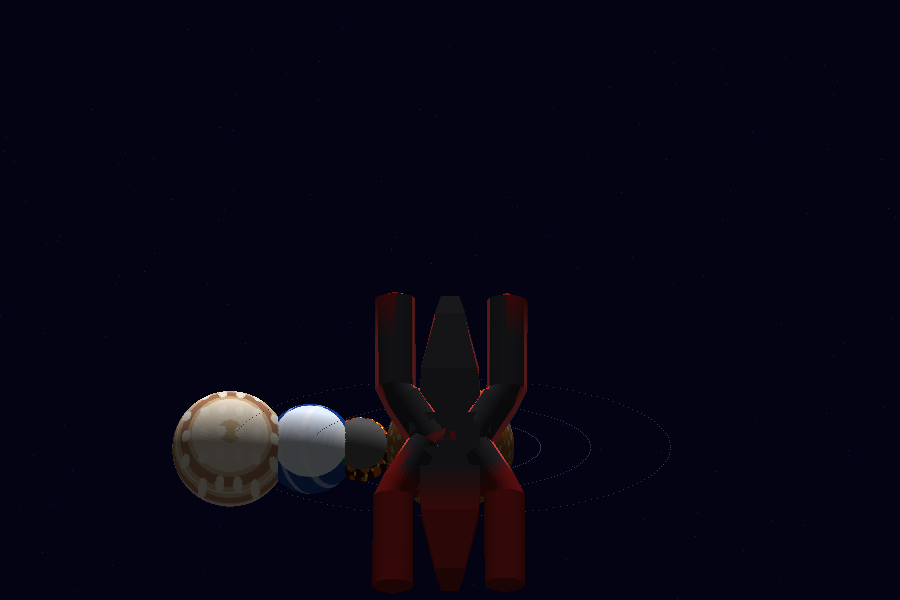

# 🚀 Proyecto 3 — Space Travel

Este repo desarrolla un **software renderer completo en Rust** que combina un sistema solar procedural con una **nave que actúa como cámara**. La simulación usa únicamente shaders de color, sin texturas externas, y la cámara siempre sigue la dirección real de la nave para que sientas que estás pilotando el vehículo entre los planetas.

---

## 🎥 Video demostrativo

👉 **[https://youtu.be/KwKRuNuw6I8](https://youtu.be/KwKRuNuw6I8)**

---

## 🌌 ¿Qué se renderiza?



* **Sol** y varios planetas con color procedimental (planeta rocoso, volcánico, gaseoso, luna e ice-giant).
 * Cada cuerpo rota y orbita con funciones trigonométricas; el sistema mantiene sus movimientos automáticos.
 * Se añaden **órbitas dibujadas**, un **starfield procedural** y un modelo OBJ para la nave.

## 🎮 Experiencia de “space travel”

* La **nave define la cámara**: su `forward` determina el `eye`/`center` del look-at y siempre se muestra en el tercio inferior de la pantalla.
* of controls: `W/S` aceleran/frenan la nave, `A/D` giran, `Shift` boost, `Up/Down` ajustan la distancia de cámara, `P` pausa, `O` toma capturas y `Esc` cierra.
* Los planetas son **estáticos para las teclas**; únicamente orbitan y rotan en el tiempo. Todo movimiento de usuario controla al vehículo espacial.

## 📐 Pipeline y arquitectura

1. **Vertex shader** paralelizado (Rayon) aplica transformaciones de modelo + cámara.
2. **Primitive assembly** junta triángulos del OBJ.
3. **Rasterización** calcula fragmentos con coordenadas barycentric.
4. **Fragment shader** pinta cada triángulo en color procedimental (capas de ruido, gradientes y bandas).
5. **Z-buffer + framebuffer** manejan profundidad y dibujo.
6. **Cámara** construida con look-at; scroll `Up/Down` mueve el eye hacia adelante/atrás.

## 🧭 Controles

| Tecla | Acción |
| ----- | ------ |
| `W` / `S` | Acelera / frena la nave |
| `A` / `D` | Gira la nave (Yaw) |
| `Shift` | Boost de aceleración |
| `Up` / `Down` | Acerca / aleja la cámara (mantiene look-at) |
| `P` | Pausa / reanuda la simulación |
| `O` | Captura PNG (`screenshot_X.png`) |
| `Esc` | Cierra la aplicación |

## 🔧 Cómo compilar y ejecutar

Necesitas Rust (cargo) instalado. Corre en modo release para un rendimiento decente:

```bash
cargo run --release
```

El renderer usa `rayon` para paralelizar los stages del pipeline y mantener un frame rate jugable.

## 📁 Estructura clave

```
/src
 ├─ main.rs        # Lógica del sistema solar + cámara + ship
 ├─ shaders.rs     # Shaders procedurales por tipo de planeta/nave
 ├─ triangle.rs    # Rasterización con barycentric
 ├─ framebuffer.rs # Framebuffer + Z-buffer
 ├─ line.rs        # Dibujo auxiliar (no usado en runtime)
 ├─ vertex.rs      # Representación de vértices y colores
 ├─ obj.rs         # Loader OBJ / generación de arrays de vértices
 └─ screenshot.rs  # Guardado de capturas en PNG

/assets/models
 ├─ sphere.obj     # Geometría base para planetas
 └─ ship.obj       # Modelo de la nave (camara)
```

## 🧠 Diseño técnico adicional

* La cámara (look-at) usa `forward = ship.forward()` y mantiene el mismo yaw que mueve al modelo.
* El sistema solar se dibuja centrado en el origen, de modo que la nave solo necesita moverse con su física para navegar entre los planetas.
* El starfield y las órbitas se recalculan por frame, dando sensación de profundidad.

## 👤 Autor

*Laboratorio 3 y 4 fusionados en el Proyecto 3 “Space Travel” (sistema solar + nave/cámara).*
